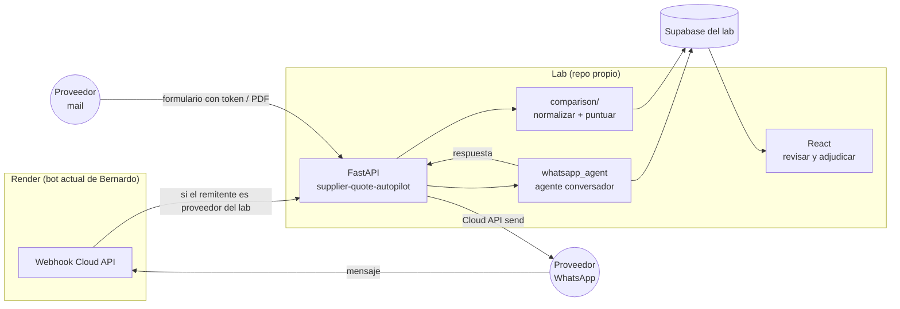

# SPEC — LABORATORIO DEL AGENTE COTIZADOR (MVP)

**Fecha**: 2026-09-26
**Estado**: spec para construir. Decisiones de Diego del 26/09 incorporadas (ver Sección 2).
**Extiende**: `PLAN-ESTRATEGICO-COTIZADOR-2026-09-26.md` Fase 3 (pasos 3.1 a 3.8) y `MVP-COTIZADOR-ALCANCE-2026-09-25.md`.
**Reemplaza**: el spike `SPIKE-COTIZADOR-AGENTE-2026-09-25.zip` como base de código. El agente conversador del spike se porta adentro de esta base; el resto del spike se descarta.
**Ítem de roadmap**: frente "Cotizador", ítem "Lab agente v0" (a crear en Fase 0, paso 0.6).

---

## 1. Qué es esto

Un **laboratorio descartable** para validar que Bernardo puede pedir cotizaciones por WhatsApp a proveedores conocidos, normalizarlas, compararlas y proponer una estrategia de compra, con la decisión final siempre en manos del comprador.

Vive en un repo propio y en un Supabase propio. **Nunca se mergea a Bernardo.** Lo que funcione se reconstruye después adentro de Bernardo con lo aprendido (Fase 3, pasos 3.4 a 3.7, a cargo del tercero).

Base: [supplier-quote-autopilot](https://github.com/olenny-coder/supplier-quote-autopilot) (MIT, Python 3.13, FastAPI, Postgres, React). Se usa entero. Se le **suma** WhatsApp como canal principal; el mail y el formulario web que ya trae quedan como canal formal y de registro.

---

## 2. Decisiones que fijan el alcance

| Decisión | Valor | Origen |
|---|---|---|
| Unidad de trabajo | Una cotización completa: lista de materiales → N proveedores → comparativo → estrategia | Diego 26/09 |
| Autonomía | Pregunta, repregunta, propone pago y entrega. Nunca confirma compra. Adjudicación humana con justificación | Diego 26/09; ya lo trae la base |
| Proveedores | Solo conocidos, cargados a mano. Ellos inician por `wa.me`. Sin búsqueda automática | Diego 26/09 |
| Lista de materiales | Excel de formato fijo. El Recetario queda afuera | Diego 26/09 |
| Canales | WhatsApp principal; mail formal y de registro (invitación, PDF oficial, resumen) | Diego 26/09 |
| Estado | Supabase nuevo, exclusivo del lab. Un solo comprador. Sin multi-tenant | Diego 26/09 |
| Nombres | Los de la base (inglés, descriptivos). Lo nuevo sigue el mismo criterio | Diego 26/09 |
| Estrategia | Dos salidas fijas: menor costo por ítem y menos proveedores. Pesos constantes: precio manda, plazo desempata | Diego 26/09 (simplificación MVP) |
| Cierre | Cada cotización cierra a las 72 h o cuando el comprador dice basta | Simplificación MVP |
| Lenguaje | Python. Código en inglés, comentarios en castellano | Regla del proyecto |

---

## 3. Arquitectura



**Regla del webhook (único cambio en Render):** si el número remitente figura en `suppliers.phone` del lab con una conversación activa, reenviar el mensaje al endpoint del lab y no pasarlo al bot. Cualquier otro mensaje sigue su camino actual. Es una condición y un `POST`; no toca la lógica del bot.

---

## 4. Qué se reutiliza y qué se agrega

### 4.1 De la base, tal cual

| Pieza | Ruta | Para qué |
|---|---|---|
| Modelo de datos | `backend/app/features/{supplier,rfq,quote,comparison,followup,invitation}` | `suppliers`, `rfqs`, `supplier_quotes`, `comparisons`, `approvals`, `follow_ups`, `invitations` |
| Normalización y puntaje | `comparison/` (units, fx, cost, score, recommend, exporters) | Costo normalizado por moneda, impuestos y entrega; puntaje ponderado; recomendación; export |
| Lectura de cotizaciones | `agents/quote_parser/` | Dos caminos (heurístico y modelo) que convergen; contrato "textual o nulo"; completitud y preguntas bloqueantes |
| Seguimientos | `backend/app/features/followup` | Recordatorio a quien no contestó, con cola de aprobación |
| Canal formal | `invitation` + `public_form` + `attachment` | Mail de invitación, formulario con token, adjuntos |
| UI | `frontend/` | Revisar comparativos, adjudicar con justificación |
| Tests | 424 offline | Se corren antes y después de cada cambio |

### 4.2 Lo que se agrega (todo en un slice nuevo `backend/app/features/whatsapp/`)

| Pieza | Qué hace |
|---|---|
| `model.py` | Tablas `whatsapp_conversations` y `whatsapp_messages` (Sección 5) |
| `router.py` | `POST /whatsapp/inbound` (recibe del webhook de Render), `POST /whatsapp/conversations/{id}/approve` (envía el borrador aprobado) |
| `agent.py` | El agente conversador portado del spike: ficha del pedido, herramientas `record_quote`, `ask_buyer`, `set_status`, frenos de entrada y salida |
| `sender.py` | Envío por Cloud API dentro de la ventana de 24 h. Sin templates en el MVP |
| `service.py` | Une conversación ↔ `rfqs` ↔ `supplier_quotes`: cada precio que el agente registra se escribe como `supplier_quotes` con `source = "whatsapp"` |
| `intake.py` (en `rfq/`) | Lee el Excel de formato fijo y crea un `rfq` por ítem, agrupados en un `rfq_batch` |

**Un detalle de la base que condiciona el diseño:** en `rfqs` un registro es **un ítem** (`item_name`, `quantity`, `unit`). Nuestra lista tiene N ítems. Se resuelve con **un `rfq` por ítem** y una tabla `rfq_batches` que los agrupa; la conversación con un proveedor es por batch. Ventaja: el motor de comparación ya trabaja por ítem, que es exactamente "cemento a A, ladrillos a B".

---

## 5. Modelo de datos nuevo

```
rfq_batches
  id, name, site_name, site_address, delivery_expectation, deadline (72 h), status, created_at
  -- un batch = una cotización completa (una lista de materiales, un rubro)

rfqs (existente) + columna
  rfq_batch_id -> rfq_batches.id

suppliers (existente) + columnas
  whatsapp_phone      -- E.164; puede diferir de phone
  rubros              -- text[]; rubros que trabaja
  last_contacted_at, quoted_count, awarded_count   -- para no repetir trabajo

whatsapp_conversations
  id, rfq_batch_id, supplier_id, status (open | complete | supplier_declined | needs_human | expired),
  opened_by ("supplier" en el MVP), opened_at, closed_at, closed_reason,
  input_tokens, output_tokens, model_calls

whatsapp_messages
  id, conversation_id, direction (inbound | outbound), body, media_url, media_type,
  wa_message_id, tool_calls (jsonb), guardrail_flags (text[]), approved_by, sent_at, received_at

supplier_quotes (existente) + columnas
  conversation_id -> whatsapp_conversations.id     -- de qué charla salió
  iva_included    -- bool | null  (la base tiene taxes en monto; acá hace falta el flag)
  freight_included -- bool | null
```

`supplier_quotes.source` toma `"whatsapp"`, `"form"` o `"email"`. Ese campo es el que después responde "por qué canal cotiza mejor cada proveedor".

**Registro de precios por fecha y condiciones** (pedido de Diego): no hace falta tabla nueva. `supplier_quotes` ya guarda por cotización: precio, moneda, plazo, forma de pago, validez, flete, impuestos, descuento, fecha de envío y proveedor. Con los dos flags nuevos queda completo. Una vista `v_price_history` (supplier, item_name, unit_price, currency, iva_included, payment_terms, submitted_at, source) es la consulta de historial.

---

## 6. Flujo de una cotización

| Paso | Qué pasa | Quién |
|---|---|---|
| 1 | El comprador sube el Excel (columnas: `item`, `quantity`, `unit`, `specification`, `accepted_alternatives`) y elige proveedores de `suppliers` | Comprador, UI |
| 2 | `intake` crea `rfq_batch` + un `rfq` por fila. Se manda **mail de invitación** (base) con el formulario y con el link `wa.me` precargado: "Hola Bernardo, soy [proveedor], mandame el pedido [batch]" | Sistema |
| 3 | El proveedor escribe por WhatsApp. El webhook de Render reenvía al lab. Se abre `whatsapp_conversation` y el agente manda la lista completa | Agente |
| 4 | Conversación: el agente responde dudas técnicas solo con la ficha del batch; registra precios y condiciones con `record_quote` → `supplier_quotes`; deriva lo que no sabe con `ask_buyer`; cierra con `set_status` | Agente, con aprobación humana de cada mensaje saliente en el MVP |
| 5 | Si el proveedor manda PDF por WhatsApp o por mail, pasa por `quote_parser` de la base | Sistema |
| 6 | A las 72 h o cuando el comprador cierra: `comparison/` normaliza y puntúa; se generan dos estrategias (menor costo por ítem, menos proveedores), cada una con su porqué | Sistema |
| 7 | El comprador adjudica en la UI con justificación escrita (`approvals`) | Comprador |
| 8 | Se genera el pedido final por proveedor y sale por mail (canal formal) con copia por WhatsApp. El botón/token de aceptación de Bernardo **no** entra en el lab: queda para la reconstrucción | Sistema |

Fuera del lab: búsqueda automática de proveedores, contacto iniciado por Bernardo (templates), audio, Recetario, pesos configurables, cobro.

---

## 7. Modelo de lenguaje

La base habla el protocolo de OpenAI vía `LLM_BASE_URL`. Dos usos distintos:

| Uso | Cómo | Por qué |
|---|---|---|
| Agente conversador de WhatsApp (nuevo) | **SDK de Anthropic nativo**, como en el spike. Modelo por env `BERNARDO_MODEL` (default `claude-sonnet-5`) | Necesita herramientas con esquema estricto y control fino de la conversación |
| Funciones de la base (`quote_parser`, seguimientos, asistentes) | Capa de compatibilidad OpenAI de Anthropic: `LLM_BASE_URL=https://api.anthropic.com/v1/`, `LLM_API_KEY` = key de Anthropic, `LLM_MODEL=claude-haiku-4-5-20251001` | Cero cambios en la base |

Advertencia verificada en la documentación oficial: la capa de compatibilidad **no soporta salidas estructuradas** y Anthropic la considera para pruebas, no para producción. La base "binds" esquemas estructurados en algunos agentes; si alguno falla, tiene fallback heurístico sin modelo. Para el lab alcanza; para la reconstrucción en Bernardo se usa el SDK nativo en todo. Fuente: [Anthropic — OpenAI SDK compatibility](https://platform.claude.com/docs/en/api/openai-sdk).

---

## 8. Frenos (se portan del spike)

- Entrada: todo mensaje o archivo de proveedor se encapsula como dato (`<supplier_message>`), sin caracteres de control, con largo máximo. Los PDFs pasan por `quote_parser`, que no ejecuta instrucciones.
- Salida: se bloquea y se deriva a humano cualquier respuesta con compromiso de compra, datos de pago o fuga del prompt. Se corrigen sin bloquear emojis y exclamaciones (voz de marca).
- El agente **no tiene herramientas con efectos externos**: escribe en la base; el envío lo hace `sender` después de la aprobación humana.
- Máximo 5 vueltas de herramientas por mensaje; si no cierra, deriva.
- Sin templates de Meta en el MVP: solo respuestas dentro de la ventana de 24 h abierta por el proveedor.

---

## 9. Criterios de "funciona"

El lab está listo para la primera cotización real cuando:

1. Los 424 tests de la base siguen pasando, más los del slice `whatsapp`.
2. El simulador de 7 proveedores del spike (portado) corre de punta a punta: ningún dato inventado, ningún compromiso de compra, todas las dudas fuera de ficha derivadas.
3. Un Excel de 5 ítems produce 5 `rfqs` en un batch y un mail de invitación con link `wa.me`.
4. Una conversación real con un proveedor conocido termina en `supplier_quotes` con precio, IVA, flete y plazo, y aparece en el comparativo.
5. `resumen` por conversación con tokens y llamadas al modelo: primer dato de costo por cotización.

Después de las 5 primeras cotizaciones reales (Fase 2 del plan) se decide qué se reconstruye adentro de Bernardo.

---

## 10. Plan de trabajo para Claude Code

Lotes secuenciales, cada uno con done-condition. Un prompt por lote; parar y revisar entre lotes.

| Lote | Qué | Done |
|---|---|---|
| L0 | Fork de la base a `drozen-star/bernardo-cotizador-lab`; Supabase nuevo; `.env`; `docker compose` o `dev.cmd` arriba; 424 tests en verde en Windows | Tests verdes; UI abre |
| L1 | Migración: `rfq_batches`, columnas en `rfqs`, `suppliers`, `supplier_quotes`; vista `v_price_history` | Migración aplicada; tests verdes |
| L2 | `intake.py`: Excel → batch + rfqs. Invitación con link `wa.me` | Excel de ejemplo produce 5 rfqs y un mail |
| L3 | Slice `whatsapp`: tablas, agente portado del spike, frenos, simulador | Simulador 7/7; tests del slice |
| L4 | `sender.py` + endpoint inbound + regla en el webhook de Render | Mensaje real de ida y vuelta con tu propio teléfono |
| L5 | Puente conversación → `supplier_quotes` → `comparison/` → dos estrategias | Cotización simulada completa termina en comparativo con dos estrategias |
| L6 | Primera cotización real con un proveedor conocido (Fase 1.5 del plan) | Criterio 4 cumplido |

Regla de anti-acumulación vigente: ningún archivo nuevo supera 400 líneas; lo nuevo va en el slice, no adentro de la base.

---

## 11. Pendientes y riesgos

| # | Pendiente | Bloquea |
|---|---|---|
| 1 | Verificar que la base levanta en Windows sin WSL (usa `dev.cmd` y `.ps1`, buena señal) | L0 |
| 2 | Confirmar cómo está escrito el webhook actual en Render (Node o Python) para redactar la regla de reenvío | L4 |
| 3 | Elegir el proveedor conocido para la primera cotización real y el rubro | L6 |
| 4 | La capa de compatibilidad OpenAI puede fallar en agentes de la base con salida estructurada; verificar en L0 cuáles se usan y si el fallback heurístico alcanza | L3 |
| 5 | Costo: cada mensaje de Bernardo son 1 a 3 llamadas; el simulador completo, 50 a 100. Medido en `whatsapp_conversations` | Ninguno; se mide |
